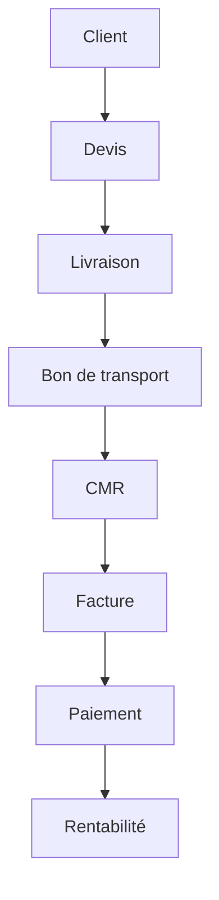

# 🚛 Transport SaaS ERP

**ERP SaaS français destiné aux artisans, TPE et PME du transport routier**

*Transport Simplifié. Gestion Maîtrisée.*

## Sommaire

- [Présentation](#présentation)
- [Fonctionnalités](#fonctionnalités)
- [Workflow métier](#workflow-métier)
- [Garanties métier](#garanties-métier)
- [Stack technique](#stack-technique)
- [Architecture](#architecture)
- [Composants Demo](#composants-demo)
- [Conventions de développement](#conventions-de-développement)
- [Installation](#installation)
- [Roadmap](#roadmap)

## Présentation

Transport SaaS est un logiciel ERP conçu spécifiquement pour les petites entreprises de transport routier (1 à 30 véhicules). Notre solution accompagne les transporteurs du devis jusqu'au paiement, en passant par la gestion des livraisons, des documents réglementaires et de la rentabilité.

**Positionnement** : ERP de gestion pour les petites entreprises de transport, pas un TMS.

**Cible** :
- Transporteurs indépendants
- Artisans du transport
- PME de transport routier
- Entreprises avec 1 à 30 véhicules

**Objectif** : Remplacer les outils traditionnels (Excel, Word, WhatsApp, papier) par une solution moderne, intégrée et optimisée pour le métier du transport.

## Fonctionnalités

### Modules principaux

- **Dashboard** : Vue d'ensemble de l'activité avec indicateurs clés
- **Clients** : Gestion complète du portefeuille clients
- **Devis** : Création et suivi des devis professionnels
- **Livraisons** : Planification et suivi des livraisons en temps réel
- **Bon de transport** : Génération automatique des bons de transport
- **CMR** : Création des lettres de voiture CMR conformes
- **Factures** : Facturation automatique et gestion des paiements
- **Dépenses** : Suivi des coûts d'exploitation et analyse
- **Rentabilité** : Analyse financière par client, trajet et véhicule
- **Camions** : Gestion de la flotte et suivi des véhicules
- **Chauffeurs** : Gestion des conducteurs et de leurs documents
- **Utilisateurs** : Gestion des accès et permissions
- **Paramètres entreprise** : Configuration des paramètres spécifiques

## Workflow métier



## Garanties métier

- Une livraison ne peut être facturée qu'une seule fois
- Une livraison facturée ne peut plus être supprimée
- Une facture payée est définitivement verrouillée
- Les PDF utilisent les paramètres entreprise
- Les CMR sont générés automatiquement

## Stack technique

- **Frontend** : Next.js 16 + TypeScript
- **UI** : Tailwind CSS
- **Backend** : Supabase (PostgreSQL + Auth)
- **Storage** : Supabase Storage

## Architecture

```
src/
├── app/               # Pages et routing Next.js
├── components/        # Composants réutilisables
│   └── demo/          # Composants de démonstration
├── hooks/             # Hooks React personnalisés
├── lib/               # Fonctions et utilitaires
└── types/             # Définitions TypeScript
```

## Composants Demo

Les composants présents dans `src/components/demo/` sont des composants statiques destinés à :

- **Landing Page** : Démonstration des fonctionnalités
- **Site officiel** : Exemples visuels
- **Documentation** : Captures d'écran
- **Marketing** : Supports commerciaux

Ces composants sont :
- Totalement statiques
- Sans logique métier
- Sans appels API
- Sans connexion à Supabase
- Avec données mockées uniquement

## Conventions de développement

### Règles du projet

1. **Petits sprints** : Chaque modification doit être ciblée et limitée
2. **Peu de fichiers modifiés** : Se concentrer sur l'objectif spécifique
3. **Build obligatoire** : Toujours vérifier que le build passe
4. **Git status obligatoire** : Vérifier les modifications avant validation
5. **Pas de gros refactoring** : Éviter les modifications massives
6. **Aucun commit automatique** : Tous les commits doivent être manuels et réfléchis
7. **Composants simples** : Privilégier la simplicité et la maintenabilité

### Bonnes pratiques

- **TypeScript strict** : Typage fort et interfaces claires
- **Composants réutilisables** : Éviter la duplication de code
- **Responsive natif** : Tous les composants doivent être adaptés mobile
- **Accessibilité** : Respect des standards WCAG
- **Performance** : Optimisation des assets et lazy loading

## Installation

```bash
# Installer les dépendances
npm install

# Lancer le serveur de développement
npm run dev

# Build pour production
npm run build
```

## Roadmap

- Finalisation des composants Demo
- Intégration dans la Landing
- Optimisation UX
- Préparation de la commercialisation

---

**Transport Simplifié. Gestion Maîtrisée.** © 2026 Transport SaaS ERP. Tous droits réservés.